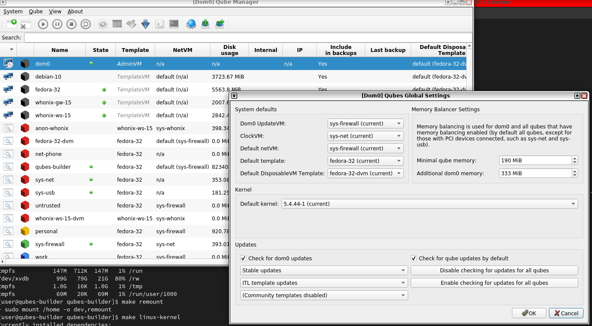
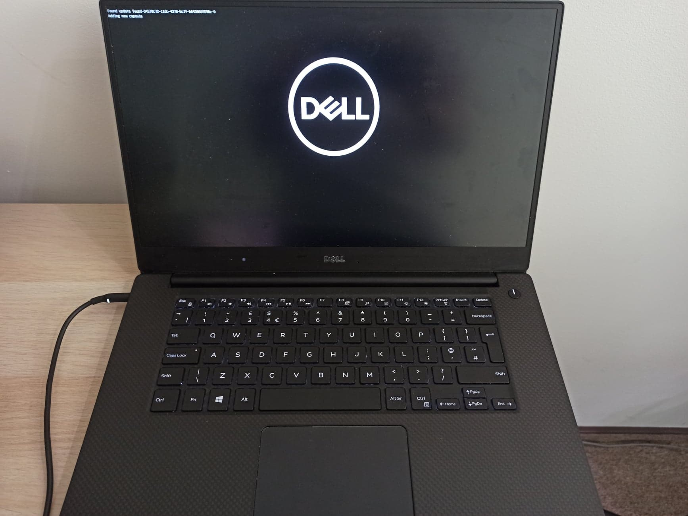
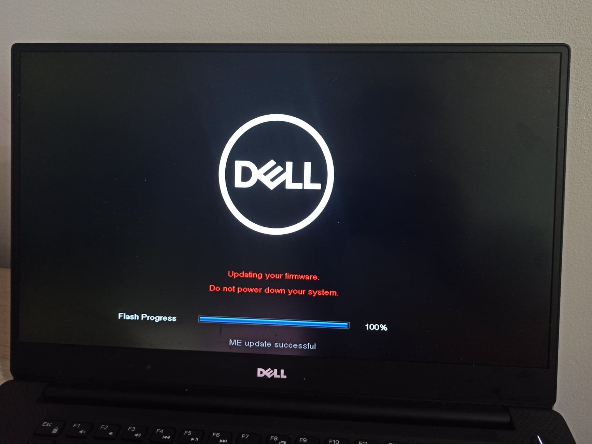
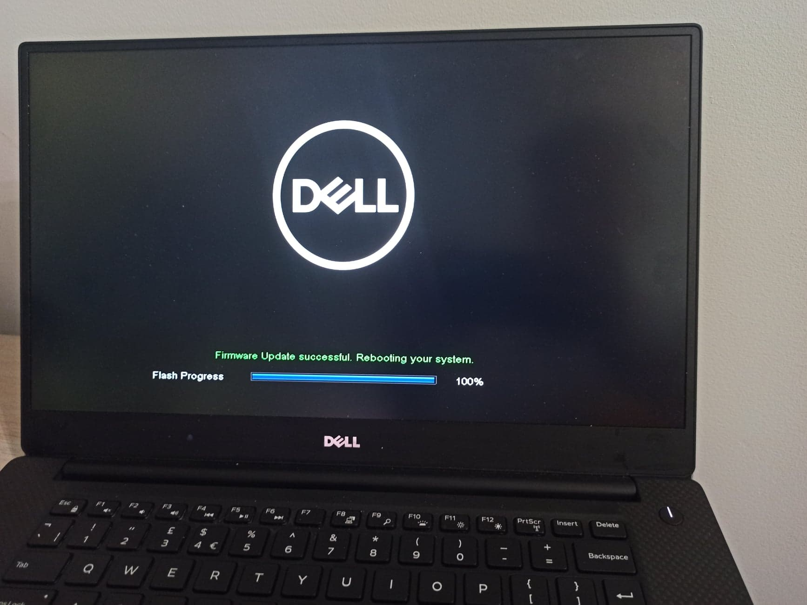

# UEFI capsule update

The qubes-fwupd handle the UEFI capsule update under several conditions.
The fwupd uses ESRT tables to read GUID, and that causes trouble when the OS
is running under a hypervisor. The Xen does not pass the ESRT tables to
paravirtualized dom0, so the Qubes is not able to provide sysfs information.
More information you can find it this thread:

https://patchwork.kernel.org/patch/11715901/

## Requirements

### Qubes OS

You need [Qubes R4.1](https://openqa.qubes-os.org/tests/10816/asset/iso/Qubes-4.1-20200726-x86_64.iso)
to use the UEFI capsule update.

### Hardware

Make sure that your hardware has available firmware updates in the [LVFS](https://fwupd.org/)

### Custom dom0 kernel

You have to build a custom linux kernel with
[patch](../misc/0017-esrt-Add-paravirtualization-support.patch) the issue
described above. At first run to qubes-builder VM (if you do not have one
look at the [installation steps](../README.md#Installation).
Edit builder.conf and add:

```
GIT_URL_fwupd = https://github.com/3mdeb/qubes-fwupd
NO_CHECK += fuwpd

COMPONENTS = ...
        builder \
        builder-debian \
        builder-rpm \
        fwupd \
        linux-kernel
```

Download the sources:

```
$ make get-sources
```

Copy [patch](../misc/0017-esrt-Add-paravirtualization-support.patch) to the
linux kernel source:

```
cp qubes-src/fwupd/misc/0017-esrt-Add-paravirtualization-support.patch qubes-src/linux-kernel
```

Edit the `kernel.spec.in` in `qubes-src/linux-kernel`:

```
Patch7: 0008-xen-netfront-copy-response-out-of-shared-buffer-befo.patch
Patch8: 0009-xen-netfront-do-not-use-data-already-exposed-to-back.patch
Patch9: 0010-xen-netfront-add-range-check-for-Tx-response-id.patch
Patch10: 0011-xen-blkfront-make-local-copy-of-response-before-usin.patch
Patch11: 0012-xen-blkfront-prepare-request-locally-only-then-put-i.patch
Patch12: 0013-xen-pcifront-pciback-Update-pciif.h-with-err-and-res.patch
Patch13: 0014-xen-pciback-add-attribute-to-allow-MSI-enable-flag-w.patch
...
Patch17: 0017-esrt-Add-paravirtualization-support.patch
```

Install dependencies:

```
$ make install-deps
# dnf install python2
$ make remount
```

Build the linux kernel. (Depending on your hardware configuration, it will take
a few hours. Build gives no output messages during the build, so just be
patient).

```
$ make linux-kernel
```

Copy package to the dom0:

```
$ qvm-run --pass-io <qubes-builder-vm-name> \
'cat <qubes-builder-repo-path>/qubes-src/linux-kernel/pkgs/dom0-fc32/x86_64/.fc32.x86_64.rpm' > \
.fc32.x86_64.rpm
```

Install kernel package. You may need to uninstall the existing one, so make sure
to backup your data!!!

```
# rpm -i kernel-5.4.55-1.qubes.x86_64.rpm
```

Run Qube manager and open dom0 global settings. Change a default kernel.



Apply the changes and reboot the system. To verify if ESRT tables are available,
check the content of:

```
ls -lah /sys/firmware/efi/esrt

total 0
drwxr-xr-x 3 root root    0 Sep  9 10:27 .
drwxr-xr-x 4 root root    0 Sep  9 05:28 ..
drwxr-xr-x 3 root root    0 Sep  9 10:27 entries
-r-------- 1 root root 4.0K Sep  9 10:27 fw_resource_count
-r-------- 1 root root 4.0K Sep  9 10:27 fw_resource_count_max
-r-------- 1 root root 4.0K Sep  9 10:27 fw_resource_version
```

If it is similar to above, you are ready to update the firmware system.

## UEFI capsule update - downgrade

UEFI capsule updates and downgrades were tested on DELL XPS 15 9560.

```
$ sudo qubes-fwupdmgr downgrade
```

[](https://asciinema.org/a/C9qgXXCjbRwXyGkffp7g3dovN)

## UEFI capsule update - update

```
$ sudo qubes-fwupdmgr update
```

[](https://asciinema.org/a/XH8SKNt4vEez6iIXEIhSxdZxC)

## Update process

### Capsule found



### ME updated



### Success


